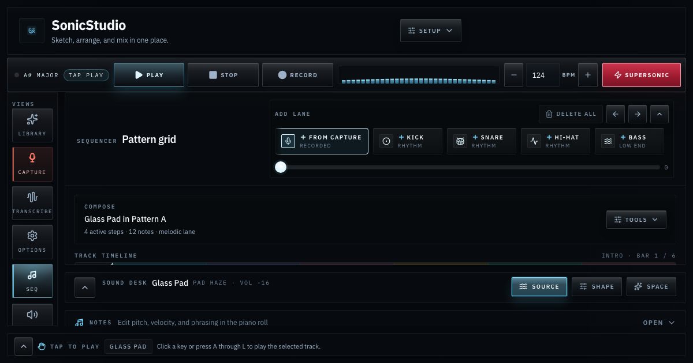

# SonicStudio

**[Open the studio](https://captainfredric.github.io/SonicStudio/)** and press Play. No install, no account.



SonicStudio is a browser-native composition studio built with React and Tone.js. It is aimed at fast song sketching, sound design, arrangement editing, and practical workflow exits inside the browser.

## Why it matters

The current build supports an actual writing flow:

1. build phrases in the step sequencer
2. arrange clips and order sections in the same view
3. shape lanes with synth and sample sources
4. bounce a mix to WAV
5. import and export MIDI
6. recover safely with checkpoints and snapshots

## Current capabilities

1. A step sequencer with inline piano-roll, arrangement, and timeline panels, plus a mixer and a sound desk, all tied to one serializable project state
2. Synth lanes and sample lanes with slice-aware triggering, and a live spectrum in the transport
3. Song markers, loop ranges, clip editing, pattern transforms, and section duplication
4. MIDI import and scoped MIDI export
5. WAV bounce with scope selection, print targets, analysis, and bounce history
6. Master presets, master snapshots, track sound recall, and recovery checkpoints
7. A genre-spanning starter library with a featured scene that rotates daily, plus compressed share links that reopen a session in one click

## Current architecture

The codebase is now split around a few real boundaries:

1. `src/context/AudioContext.tsx`
   Thin integration shell for the audio provider. It now wires controllers, reducer state, persistence, keyboard shortcuts, and the public context surface instead of owning the reducer internals directly.
2. `src/context/editor/projectMutations.ts`
   Pure arranger clip and track mutation helpers used by the reducer.
3. `src/context/editor/editorDispatchers.ts`
   Dispatch-bound action methods used by the provider so action wiring is no longer handwritten inline.
4. `src/context/editor/keyboardShortcuts.ts`
   Runtime keyboard shortcut bridge for undo, redo, save, transport, metronome, and pattern focus.
5. `src/context/editor/reducer/*`
   Domain reducer ownership split across UI, project, track source, note-event editing, note-pattern editing, clip-pattern step editing, clip-pattern event editing, automation, transforms, track structure, arranger, and history action maps, plus reducer utilities and editor state types.
6. `src/context/editor/transportController.ts`
   Playback, recording, preview, and transport reset orchestration for the provider layer.
7. `src/context/editor/renderController.ts`
   Provider-facing mix, stem, MIDI, and bounce-history orchestration.
8. `src/context/editor/sessionController.ts`
   Provider-facing session import, export, restore, checkpoint, and template-load orchestration.
9. `src/app/routeController.ts`
   Explicit launch and deep-link state resolution so first run, persisted sessions, and query-driven entry all follow one path.
10. `src/services/renderWorkflow.ts`
   Render and bounce orchestration.
11. `src/services/sessionWorkflow.ts`
   Persistence, checkpoint, and import orchestration.
12. `src/components/settings/*`
   Workspace, track, and output controls broken into smaller panels.
13. `src/components/arranger/*`
   Arranger selector logic, interaction utilities, clip drag and paint hooks, viewport and shortcut hooks, inspector panels, and hero-surface view modules.

The reducer is now split across small, focused action maps (the largest is under
300 lines), and every provider seam has its own test file: transport, session
restore and checkpoints, render and export scope, and route-driven entry. The
per-keystroke corpus summary has also been moved off the edit hot path — it
recomputes after edits settle rather than on every toggle.

The provider's stable callbacks now live in their own actions context
(`useAudioActions`), so a component that only dispatches no longer re-renders
when tracks, selection, or the playhead change; the per-step playhead has its own
context as well. The remaining targets are smaller and more contained:

1. device-rack source ownership is still concentrated in the slice and source-window authoring path
2. heavy views still read editor state through one shared context, so narrowing those reads to per-slice subscriptions is the next render-churn lever if large projects ever need it

## Quick start

1. Start the dev server or open the hosted build
2. Use the launch surface to open a real scene, start blank, or import MIDI
3. Load `Beat Lab` for rhythm work or `Night Transit` for a fuller song sketch
4. Open the Arrangement panel in the sequencer to inspect clips and sections
5. Open the Notes panel for tighter pitch and gate editing
6. Export MIDI from the Setup menu, or bounce a WAV from Output settings

## Run locally

Prerequisite: Node.js 20+

```bash
npm install
npm run dev
```

Vite serves the studio at `http://localhost:3000/`.

For a portable static bundle that works on root-based static servers, use:

```bash
npm run build
```

For GitHub Pages under `/SonicStudio/`, use:

```bash
npm run build:pages
```

## Screenshots

The README and Open Graph images (`public/share/`) are captured from the running
app, so they stay honest after UI changes. With a dev server up, regenerate them:

```bash
npm run dev                  # serves the studio
npx playwright install chromium   # once
CAPTURE_URL=http://127.0.0.1:3000 npm run capture:hero
```

## Verification

```bash
npm run lint
npm test
npm run build
```

`npm run lint` runs the TypeScript compiler and ESLint (typescript-eslint plus the React hooks rules); `npm test` runs the Vitest suite; `npm run build` type-checks and produces the production bundle.

Current test coverage includes reducer invariants, arranger selector and interaction logic, clip mutation helpers, note edit hydration, MIDI round trips, transport-controller behavior, render workflow behavior, session workflow behavior, explicit route resolution, controller-level render and restore seams, component render smoke tests, the share-link codec and lazy-load retry, and registry integrity checks that build every starter scene and validate every voice preset.

## Project direction

The strongest next milestones are:

1. keep shrinking reducer concentration in note-pattern and clip-pattern step ownership
2. expand correctness coverage around reducer action-map behavior, checkpoint restore, transport state, render-scope replay, and route-driven entry
3. keep the device rack moving toward true source, shape, space, slicing, and recall ownership boundaries, with the slice and source-window path next
4. keep the arranger focused on composition fluency instead of growing every side feature equally
5. keep the launch surface and route entry logic explicit instead of drifting back into layered shell clutter
